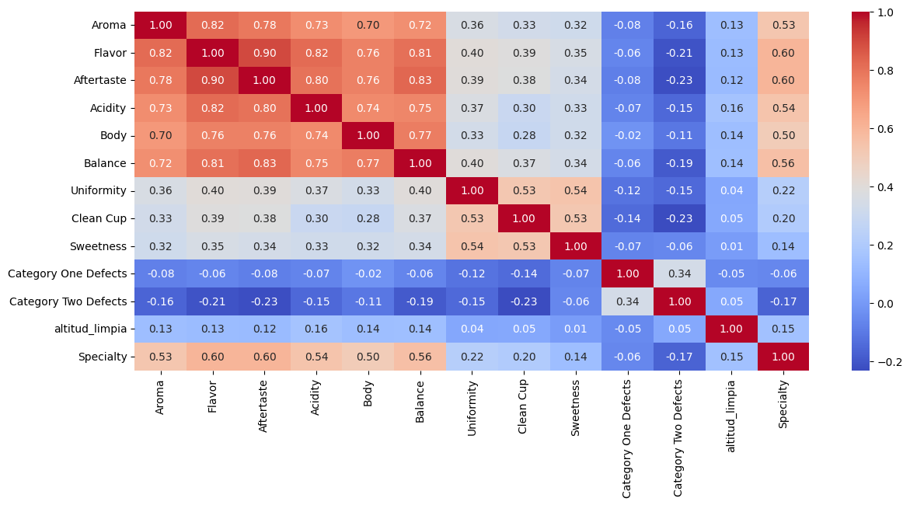
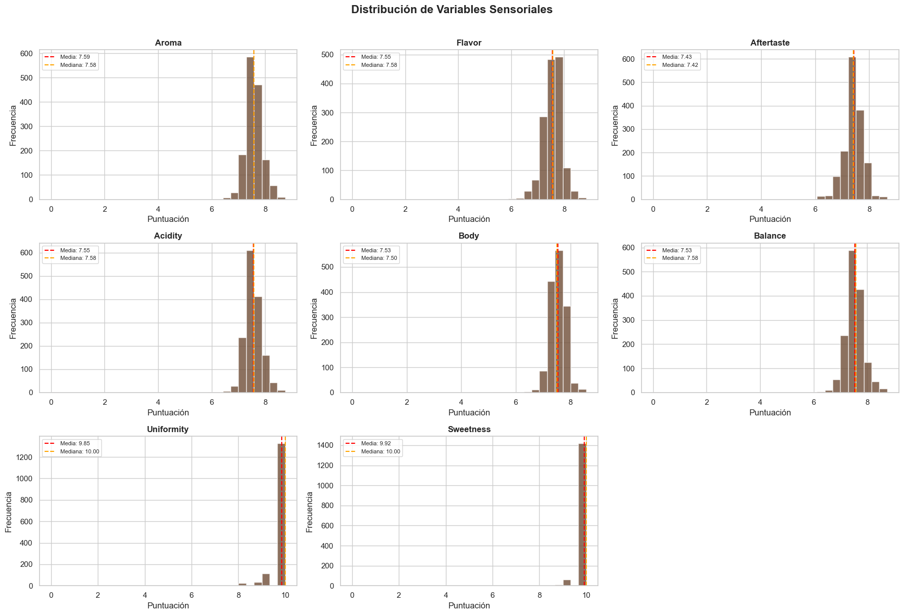
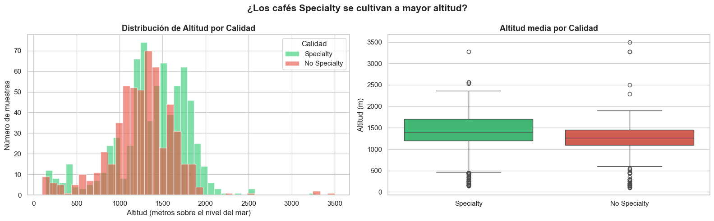
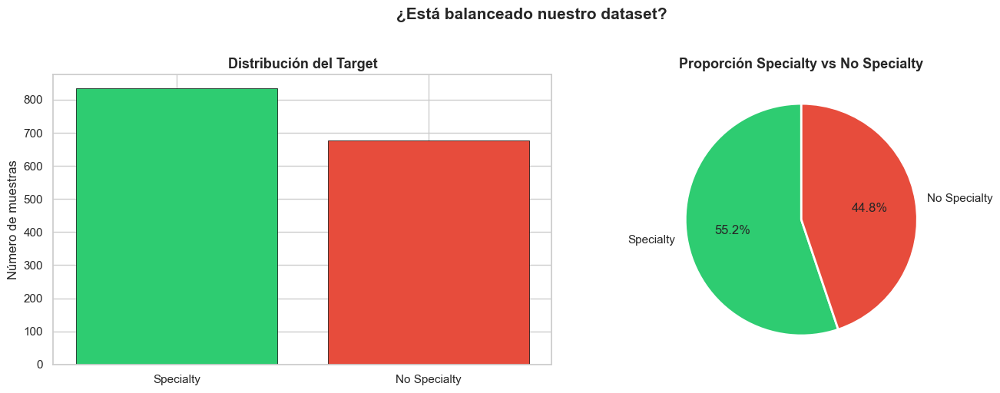
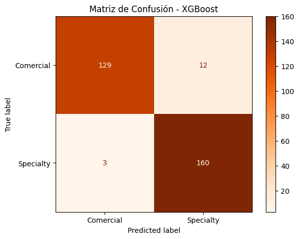

# ☕ Documento de Decisiones Técnicas y Estratégicas
## Proyecto: Gemelo Digital para Clasificación de Calidad de Café
### Versión 2.0 — Proyecto Grupal con modelos independientes

---

## 📋 ÍNDICE

1. [Problema de negocio y su redefinición](#1-problema-de-negocio-y-su-redefinición)
2. [Contexto grupal del proyecto](#2-contexto-grupal-del-proyecto)
3. [Escenarios de negocio y métrica prioritaria](#3-escenarios-de-negocio-y-métrica-prioritaria)
4. [Problemas técnicos encontrados y decisiones tomadas](#4-problemas-técnicos-encontrados-y-decisiones-tomadas)
5. [Decisiones de diseño justificadas](#5-decisiones-de-diseño-justificadas)
6. [Resultados de modelos](#6-resultados-de-modelos)
7. [Flujo del proyecto](#7-flujo-del-proyecto)
8. [Flujo futuro — Roadmap del Gemelo Digital](#8-flujo-futuro--roadmap-del-gemelo-digital)
9. [Riesgos técnicos documentados](#9-riesgos-técnicos-documentados)
10. [Limitaciones honestas que hay que defender](#10-limitaciones-honestas-que-hay-que-defender)

---

## 1. Problema de Negocio y su Redefinición

### ❌ Planteamiento inicial (incorrecto)
> *"El modelo reemplaza al Q-Grader humano"*

**Por qué es incorrecto:**
El modelo necesita como input las puntuaciones sensoriales (Aroma, Flavor, etc.)
que precisamente genera el Q-Grader. Si ya tienes al experto evaluando, él mismo
puede ver si la suma supera 82.5 puntos.

### ✅ Planteamiento correcto
> *"El modelo democratiza el acceso a la certificación de calidad, permitiendo que
> técnicos sin certificación Q-Grader puedan hacer evaluaciones preliminares fiables
> y decidir en qué lotes vale la pena invertir en certificación oficial."*

### 🎯 Usuarios reales del sistema

| Usuario | Situación actual | Valor que aporta el modelo |
|---------|-----------------|---------------------------|
| Técnico de planta sin certificación | Evalúa sensorialmente pero no puede certificar | Convierte su evaluación básica en predicción con probabilidad |
| Exportadora con 50+ lotes/día | No puede pagar Q-Grader para cada lote | Filtra rápido cuáles merecen certificación |
| Q-Grader en formación | Criterio no calibrado aún | Compara sus puntuaciones contra patrones históricos CQI |
| Cooperativa rural | Sin acceso a expertos certificados | Predicción antes de invertir en proceso de certificación |

---

## 2. Contexto Grupal del Proyecto

### Estructura del equipo

El proyecto fue desarrollado en grupo con **modelos independientes**. Cada miembro
realizó su propio EDA y entrenó sus modelos de forma individual para maximizar el
aprendizaje sin dividir roles artificialmente.

| Miembro | Modelos entrenados | Modelo ganador |
|---------|-------------------|----------------|
| Jonathan | Logistic Regression + Random Forest | Random Forest |
| JJ | Logistic Regression + Random Forest | Random Forest |
| Camila | Decision Tree + XGBoost / LightGBM | XGBoost |
| Juanma | Decision Tree + XGBoost / LightGBM | XGBoost |

### ¿Se justifica que cada uno haya entrenado con variables diferentes?

**Sí.**

Cada miembro exploró un espacio de features distinto de forma independiente.
Esto no es un error de coordinación — es una ventaja metodológica real que permite
comparar no solo algoritmos, sino el impacto del feature engineering en el rendimiento.

**Defensa en la presentación:**
> *"Cada miembro exploró una configuración de features diferente de forma deliberada.
> Esto nos permitió comparar no solo los algoritmos, sino también el impacto del
> feature engineering. El Streamlit final integrará el modelo que mostró mayor
> CV F1 Media en validación cruzada."*

**Requisito para que sea válido:** todos deben haber usado:
- Mismo CSV de entrada: `coffee_quality_eda_fusion.csv`
- `test_size=0.2` con `stratify=y` y `random_state=42`
- F1 como métrica principal + ROC-AUC como secundaria + Recall

> 💡 Verificación: si `print(X_test.shape, y_test.sum())` da el mismo resultado
> en todos los notebooks, los splits son idénticos y las métricas son directamente comparables.

---

## 3. Escenarios de Negocio y Métrica Prioritaria

Esta es una de las decisiones más importantes del proyecto porque define
qué tipo de error es más costoso y cómo debe optimizarse el modelo.

### ¿Qué es cada tipo de error?

| Error | Descripción | Consecuencia |
|-------|-------------|--------------|
| **Falso Negativo (FN)** | Predice No Specialty cuando es Specialty real | Se vende a precio commodity en lugar de premium |
| **Falso Positivo (FP)** | Predice Specialty cuando es No Specialty real | Se manda a certificación oficial innecesariamente |

---

### 🔴 Escenario A — Minimizar FN (priorizar Recall)

**Contexto:** una exportadora con muchos lotes quiere asegurarse de no perderse
ningún café Specialty. Su mayor miedo es clasificar un Specialty real como No Specialty
y venderlo a precio commodity. La pérdida es directa y proporcional al volumen del lote.

**Métrica principal:** Recall
**Objetivo:** Recall ≥ 0.97 — no perderse más del 3% de los Specialty reales

**¿Cómo se trabaja?**

1. Definir `scoring='recall'` en RandomizedSearchCV y cross_val_score:
```python
scoring = 'recall'
```

2. El modelo ganador es el de mayor Recall con Precision aceptable.

3. Si el Recall del modelo ganador sigue siendo insuficiente, bajar el umbral
   de decisión (sin reentrenar):
```python
# Por defecto el umbral es 0.50 — bajarlo aumenta Recall
umbral = 0.40
y_pred = (modelo.predict_proba(X_test)[:, 1] >= umbral).astype(int)
```

4. Documentar el trade-off: bajar el umbral sube Recall pero baja Precision.

**Resultado en nuestro RF base (sin cambios):**
```
Umbral 0.50 → Recall=0.9760 | Precision=0.9314 | F1=0.9532
Umbral 0.45 → Recall=0.9820 | Precision=0.9213 | F1=0.9507  ← más Recall
Umbral 0.40 → Recall=0.9880 | Precision=0.9100 | F1=0.9475
```

> ✅ Nuestro RF ya tiene Recall=0.976 de base — en este escenario no sería necesario cambiar nada más que documentar la decisión.

---

### 🔵 Escenario B — Minimizar FP (priorizar Precision)

**Contexto:** el modelo actúa como filtro previo a la certificación oficial.
Mandar un No Specialty a certificar tiene un coste fijo (tiempo + dinero).
El objetivo es no desperdiciar recursos enviando lotes que no van a pasar.

**Métrica principal:** Precision
**Objetivo:** Precision ≥ 0.97 — de los que mandamos a certificar, ≥97% deben pasar

**¿Cómo se trabaja?**

1. Definir `scoring='precision'` en RandomizedSearchCV y cross_val_score:
```python
scoring = 'precision'
```

2. El modelo ganador es el de mayor Precision con Recall aceptable.

3. Si la Precision del modelo ganador sigue siendo insuficiente, subir el umbral
   de decisión (sin reentrenar):
```python
# Subir el umbral aumenta Precision pero baja Recall
umbral = 0.60
y_pred = (modelo.predict_proba(X_test)[:, 1] >= umbral).astype(int)
```

4. Documentar el trade-off: subir el umbral sube Precision pero baja Recall —
   más Specialty reales se quedarán sin certificar.

---

### ⚖️ Comparativa de escenarios

| | Escenario A | Escenario B |
|--|-------------|-------------|
| **Error que evita** | Falso Negativo (FN) | Falso Positivo (FP) |
| **Métrica principal** | Recall | Precision |
| **Acción sobre umbral** | Bajar (ej. 0.40) | Subir (ej. 0.60) |
| **Usuario típico** | Exportadora buscando maximizar lotes premium | Cooperativa optimizando costes de certificación |
| **Riesgo de no optimizar** | Pérdida de margen en lotes mal clasificados | Gasto innecesario en certificaciones fallidas |

### 🔑 Decisión del equipo

>**Elegido el Escenario A**
>
>*Pensamos que es más interesante enfocarnos en el negocio y venta del café a su correcto precio porque habrá muchas más empresas aunque sean pequeñas que estén más interesadas en la venta que en la certificación para concurso.*

>*También es muy importante para las empresas que envíen a certificar sólolo lotes de café Specialty y no cualquier lote. Obtendrán ahorro de logística, dinero, recursos humanos, etc.*


**Importante:** si el escenario se decide después del entrenamiento, no es necesario
reentrenar. Basta con ajustar el umbral de decisión. Solo hay que reentrenar si
el Recall o Precision objetivo no se alcanza ni siquiera moviendo el umbral.



---

## 4. Problemas Técnicos Encontrados y Decisiones

### 🔴 Problema 1 — Dataset demasiado pequeño (207 filas)

**¿Por qué es un problema?**
Con 207 filas, el split 80/20 deja solo ~42 filas para test. Con tan pocas muestras,
las métricas son estadísticamente poco fiables y pueden variar mucho si se cambia
la semilla del split.

**Decisión tomada:** fusionar con dataset de volpatto (2018) de la misma fuente (CQI)

| Criterio de compatibilidad | Verificado |
|---------------------------|------------|
| Mismo organismo emisor (Coffee Quality Institute) | ✅ |
| Mismo protocolo de evaluación (SCA-104) | ✅ |
| Misma escala de puntuación (0-10 por atributo) | ✅ |
| Variables prácticamente idénticas | ✅ |
| Dataset shift verificado con histogramas superpuestos | ✅ |

**Resultado:** ~1.512 filas → métricas estadísticamente representativas

---

### 🔴 Problema 2 — Variables sin varianza (Uniformity, Sweetness, Clean Cup)

**¿Por qué es un problema?**
En el dataset 2023, estas tres variables tienen valor 10 para prácticamente todos
los registros. Una variable sin varianza no discrimina entre clases.

**Decisión tomada:** eliminar las tres variables del modelo

> ✅ **Efecto secundario positivo:** en el dataset fusionado con los datos de 2018,
> Uniformity y Sweetness sí tienen varianza real (valores entre 6 y 10).
> Podrían recuperarse en versiones futuras del modelo.



---

### 🔴 Problema 3 — Data Leakage con Total Cup Points

**¿Por qué es un problema?**
`Total Cup Points` es la suma de todas las variables sensoriales. El target
(`quality_label`) se construye directamente de esta columna. Si no se elimina,
el modelo aprende que Specialty = Total Cup Points ≥ 82.5 con 100% de accuracy
pero sin aprender nada real sobre los predictores.

**Orden correcto:**
```python
# 1. Crear target PRIMERO
df['quality_label'] = df['Total Cup Points'].apply(
    lambda x: 'Specialty' if x >= 82.5 else 'No Specialty'
)
# 2. Eliminar la columna fuente DESPUÉS
df = df.drop(columns=['Total Cup Points'])
```

---

### 🔴 Problema 4 — Columna fantasma `Unnamed: 0`

**¿Por qué aparece?**
Cuando se guarda el CSV sin `index=False`. El dataset estaba ordenado por
puntuación descendente, por lo que el índice tenía correlación negativa
artificial de -0.65 con el target.

**Solución permanente:**
```python
df.to_csv('archivo.csv', index=False)  # Siempre con index=False
```

---

### 🔴 Problema 5 — Altitud con valor máximo de 190.164m

**¿Por qué ocurre?**
El filtro `parsear_altitud()` solo se aplicaba al dataset 2023. El dataset 2018
también tiene su columna Altitude con valores imposibles y nunca pasó por el filtro.

**Decisión tomada:** aplicar `parsear_altitud()` a ambos datasets antes de fusionar

```python
# Aplicar a dataset 2018 también — mismo filtro que al 2023
df_2018['altitud_limpia'] = df_2018['Altitude'].apply(parsear_altitud)
df_2018.loc[
    (df_2018['altitud_limpia'] < 100) | (df_2018['altitud_limpia'] > 3500),
    'altitud_limpia'
] = np.nan
```



---

### 🟡 Problema 6 — Desbalance de clases (~55/45)

Distribución final tras la fusión: Specialty=834 (55.2%) / No Specialty=678 (44.8%).
Prácticamente balanceado, pero se aplican medidas preventivas.

| Capa | Técnica | Dónde se aplica |
|------|---------|----------------|
| En el modelo | `class_weight='balanced'` | Logistic Regression, Decision Tree, Random Forest |
| En XGBoost | `scale_pos_weight = n_neg/n_pos` | XGBoost |
| En la validación | `stratify=y` en el split | Train/Test split |
| En las métricas | Priorizar F1 y ROC-AUC sobre Accuracy | Evaluación de modelos |



---

### 🟡 Problema 7 — Umbral 82.5 no es el estándar oficial SCA

El umbral oficial definido en el documento SCA-104 es **80 puntos**, no 82.5.

**Justificación adoptada:**
> *"Usamos 82.5 como umbral conservador, por encima del mínimo oficial SCA de 80 puntos,
> para centrarnos en los cafés de mayor calidad dentro del rango specialty y reflejar
> el criterio real de las competiciones internacionales del CQI donde se originan
> los datos de entrenamiento."*

---

### 🟡 Problema 8 — Nombres de columnas inconsistentes entre datasets

El dataset 2018 usa puntos (`Country.of.Origin`) y el de 2023 usa espacios
(`Country of Origin`). Además `Cupper Points` (2018) = `Overall` (2023).

**Normalización en tres pasos:**
1. `df_2018.columns.str.replace('.', ' ')` → unificar separadores
2. Renombrado explícito: `'Cupper Points'` → `'Overall'`
3. `str.strip().str.title()` en valores categóricos → unificar mayúsculas

---

### 🟡 Problema 9 — Features distintas entre modelos del equipo

**¿Por qué es un problema?**
Cada miembro entrenó con columnas diferentes. El notebook de comparación y el
Streamlit necesitan gestionar qué input enviar a cada modelo sin romper la inferencia.

**Decisión tomada:** cada miembro guarda sus splits ya procesados junto al modelo.
El notebook de comparación carga los `.pkl` directamente sin reconstruir nada desde el CSV.

```python
# Cada miembro añade al final de su notebook de modelado:
joblib.dump(X_train, '../models/[Miembro]/X_train.pkl')
joblib.dump(X_test,  '../models/[Miembro]/X_test.pkl')
joblib.dump(y_train, '../models/[Miembro]/y_train.pkl')
joblib.dump(y_test,  '../models/[Miembro]/y_test.pkl')

joblib.dump(encoders,  '../models/[Miembro]/encoders.pkl')
joblib.dump(feature_names,  '../models/[Miembro]/feature_names.pkl')
```

---

### 🟡 Problema 10 — Multicolinealidad severa entre variables sensoriales

**VIF calculado sobre las sensoriales:**

| Variable | VIF |
|----------|-----|
| Flavor | 2656 |
| Aftertaste | 2273 |
| Balance | 1457 |
| Acidity | 1434 |
| Body | 1359 |
| Aroma | 1292 |
| Category Two Defects | 1.72 |
| altitud_limpia | 1.06 |

**Impacto:**
- **Logistic Regression:** VIF >2000 invalida la interpretación de coeficientes → se usa Ridge (L2, C=0.1) para estabilizar
- **Random Forest:** inmune a la multicolinealidad → no requiere ningún ajuste
- **Arbol de Decisión:** inmune a la multicolinealidad → no requiere ningún ajuste
- **XGBoost:** inmune a la multicolinealidad → no requiere ningún ajuste
- **Conclusión:** justifica usar RF o XGBoost como modelos principales

---


## 5. Decisiones de Diseño Justificadas

| Decisión | Justificación |
|----------|---------------|
| Umbral 82.5 en lugar de 80 (SCA oficial) | Umbral conservador propio — documentado explícitamente como NO estándar oficial |
| LabelEncoder en lugar de OneHotEncoder | RF y XGBoost lo manejan bien; OHE con 37 países generaría 37 columnas innecesarias |
| Agrupación a 'Other' antes de imputar | Imputar antes rompe la distribución de la moda sobre categorías fragmentadas |
| Conservar outliers sensoriales | Con 1.512 filas, eliminar ~5% de datos es perder poder estadístico innecesariamente |
| Ridge (L2, C=0.1) en LR baseline | VIF >2.000 en sensoriales hace LR estándar matemáticamente inestable |
| `min_samples_leaf=5` en RF | Con 1.209 train, hojas con 2 muestras favorecen overfitting |
| `stratify=y` en split | Mantener proporción 55/45 en train y test |
| Scaler fit solo en train | Evitar data leakage del test al train |
| `dataset_source` eliminado del modelo | Es auditoría del origen del dato, no señal predictiva real |
| Modelos independientes por miembro | Experimentación paralela de feature engineering — se comparan algoritmos Y configuraciones de features |
| Criterio de selección: CV F1 Media | Más robusto que F1 en test — promedia 5 splits distintos, menos dependiente de la suerte del split |
| Ajuste de umbral antes de reentrenar | Cambiar el umbral de decisión es más rápido, más explicable y no modifica el modelo |

---

## 6. Resultados de Modelos

### Resultados de Jonathan

| Modelo | Accuracy | Precision | Recall | F1 | ROC-AUC | CV F1 Media | CV F1 Std |
|--------|----------|-----------|--------|----|---------|-------------|-----------|
| Logistic Regression (Ridge L2, C=0.1) | 0.9307 | 0.9398 | 0.9341 | 0.9369 | 0.9737 | 0.9290 | 0.0088 |
| Random Forest (Base) | 0.9472 | 0.9314 | 0.9760 | 0.9532 | 0.9742 | 0.9324 | 0.0188 |
| Random Forest (Optimizado) | 0.9373 | 0.9157 | 0.9760 | 0.9449 | 0.9733 | 0.9363 | 0.0171 |

### Decisión: Random Forest Base como modelo ganador

**¿Por qué el base y no el optimizado?**

El optimizado mejora el CV F1 Media en solo **+0.004** — diferencia dentro del margen
de ruido estadístico. A cambio sacrifica:
- Precision: -0.016 (más falsos positivos)
- F1 test: -0.008
- ROC-AUC: -0.001

El Recall es idéntico en ambos (0.9760). No hay trade-off que justifique el cambio.

> **Regla aplicada:** cuando la mejora en CV F1 Media es marginal (< 0.01) y
> otras métricas empeoran, el modelo más simple gana por parsimonia.

---

### Resultados de Camila

| Modelo | Accuracy | F1 | ROC-AUC |
|--------|----------|----|---------|
| Arbol de Decisión | 0.9046 | 0.9145 | 0.9535 |
| XGBoost | 0.9507 | 0.9552 | 0.9904 |

### Decisión: XGBoost Base como modelo ganador

---

### Resultados de Juan

| Modelo | Accuracy | Precision | Recall | F1 | ROC-AUC | CV F1 Media | CV F1 Std |
|--------|----------|-----------|--------|----|---------|-------------|-----------|
| Arbol de Decisión | 0.8944 | 0.8721 | 0.9375 | 0.9036 | 0.9408 | 0.9118 | 0.0145 |
| XGBoost | 0.9340 | 0.9167 | 0.9625 | 0.9390 | 0.9700 | 0.9333 | 0.0192 |

### Decisión: XGBoost Base como modelo ganador

---

### Tabla comparativa entre miembros del equipo

| Miembro | Modelo | Features | F1 Test | ROC-AUC | CV F1 Media | CV F1 Std | Overfitting |
|---------|--------|----------|---------|---------|-------------|-----------|-------------|
| Camila | XGBoost | 15 | 0.9552 | 0.9904 | 0.9449 | 0.0048 | 0.0322 |
| Jonathan | Random Forest | 15 | 0.9532 | 0.9742 | 0.9324 | 0.0188 | 0.0146 |
| Juan | XGBoost | 15 | 0.9390 | 0.9700 | 0.9333 | 0.0192 | 0.0086 |




### Análisis de overfitting

Un modelo sano tiene **F1 Train − F1 Test < 0.05**.

| Δ (F1 Train − F1 Test) | Diagnóstico |
|------------------------|-------------|
| < 0.02 | Sin overfitting — modelo muy estable |
| 0.02 – 0.05 | Overfitting leve — aceptable |
| > 0.05 | Overfitting significativo — revisar regularización |
| > 0.10 | Overfitting severo — el modelo no generaliza |

---

## 7. Flujo del Proyecto

### Flujo individual por miembro

```
Dataset 2023 (207 filas)  +  Dataset 2018 (1311 filas)
              │                        │
              └────────────┬───────────┘
                           ▼
              00_fusion_datasets.ipynb
              · Normalizar nombres de columnas
              · Aplicar parsear_altitud() a AMBOS datasets
              · Detectar y eliminar duplicados
              · Validar compatibilidad
                           │
                           ▼
              coffee_quality_fusionado.csv (~1.512 filas)
                           │
                           ▼
              01_EDA_[miembro].ipynb
              · Distribuciones y correlaciones
              · Análisis de outliers
              · Análisis por país y método de proceso
                           │
                           ▼
              coffee_quality_eda_fusion_clean_[miembro].csv
                           │
                           ▼
              03_modeling_[miembro].ipynb
              · Limpieza final + imputación + encoding
              · Split 80/20 stratificado
              · Modelos + RandomizedSearchCV
              · Comparación y selección del ganador
                           │
                           ▼
              [Miembro]/models/
              ├── model.pkl
              ├── scaler.pkl (solo si usa LR/SVM)
              ├── encoders.pkl
              ├── feature_names.pkl
              ├── X_train.pkl
              ├── X_test.pkl
              ├── y_train.pkl
              └── y_test.pkl
```

### Flujo de integración grupal

```
Feature/Jonathan + Feature/Camila + Feature/Juanma + Feature/JJ
       │                 │                │                |
       └────────────────────┼──────────────────────────────┘
                            ▼ Pull Requests
                       rama: union
                            │
                            ▼
              04_comparacion_modelos.ipynb
              · Cargar los 3 modelos desde sus .pkl
              · Calcular métricas comparativas
              · Análisis de overfitting
              · Curvas ROC y matrices de confusión
              · Selección del modelo para el Streamlit
                            │
                            ▼
                    app/main.py (Streamlit)
                    · Input: técnico introduce valores sensoriales
                    · Modelo: el ganador del notebook 04
                    · Output: Specialty / No Specialty + probabilidad
```

---

## 8. Flujo Futuro — Roadmap del Gemelo Digital

```
NIVEL 1 — HOY (vuestro proyecto)
─────────────────────────────────
Técnico evalúa sensorialmente (cata básica)
     │
     ▼
Introduce valores en app: [Aroma: 7.8, Flavor: 7.9...]
     │
     ▼
Modelo → Specialty ✅ / No Specialty ❌ + probabilidad
     │
     ▼
Decisión: ¿mandar a certificación oficial o no?


NIVEL 2 — CORTO PLAZO (tecnología disponible hoy en laboratorio)
─────────────────────────────────────────────────────────────────
SENSORES AUTOMÁTICOS
· E-Nose (Nariz Electrónica)  → detecta compuestos volátiles
· Espectroscopía NIR          → composición química del grano
· Lengua Electrónica          → perfil de sabor en solución
     │
     ▼ genera automáticamente
[Aroma: 7.8, Flavor: 7.9, Acidity: 7.7...]
     │
     ▼ (mismo modelo, mismo código)
Modelo → Specialty ✅ / No Specialty ❌
     │
     ▼
Sin intervención humana. Escalable a cientos de lotes por día.


LA CLAVE ARQUITECTÓNICA:
Nuestro modelo opera en la CAPA DE DECISIÓN.
El input puede venir de un humano HOY o de un sensor MAÑANA.
El modelo no cambia — solo cambia quién alimenta los datos.
```

---

## 9. Riesgos Técnicos Documentados

| Riesgo | Descripción | Estado | Afecta a |
|--------|-------------|--------|----------|
| Circularidad del target | Total Cup Points es suma de sensoriales — modelo casi predice la suma | Documentado y aceptado | Todos |
| Multicolinealidad severa | VIF >2.000 entre sensoriales | Solo afecta LR; RF inmune | Jonathan |
| Dataset shift | 2018 y 2023 — distribuciones verificadas con histogramas | Verificado | Todos |
| Altitud con 15% nulos | Filtro aplicado a ambos datasets, nulos imputados con mediana | Resuelto | Todos |
| Features distintas entre miembros | Inferencia diferente por modelo en el notebook de comparación | Resuelto con splits guardados en .pkl | Notebook 04 |
| Variety con LabelEncoder | 11 categorías codificadas ordinalmente sin sentido agronómico | Aceptado para RF | Jonathan |
| Ajuste de umbral no documentado | Cambiar el umbral sin registrarlo hace las métricas no reproducibles | Documentar siempre el umbral usado | Todos |

---

## 10. Limitaciones
---

**Limitación 1 — El modelo clasifica, no evalúa**

El modelo no "cata" el café. Toma puntuaciones ya generadas y decide
si la suma supera el umbral. El paso de café real → números sensoriales
sigue requiriendo un agente (humano o sensor) externo al modelo.

*Argumento:* La capa de decisión y la capa de evaluación son problemas
independientes. Nosotros resolvemos la capa de decisión con alta fiabilidad.

---

**Limitación 2 — Circularidad del target**

`Total Cup Points` es la suma de las variables sensoriales. El modelo
básicamente aprende a predecir si la suma supera 82.5 mirando los sumandos.
En producción, si tienes todas las puntuaciones individuales, ya puedes calcular la suma tú mismo.

*Argumento:* El valor real está en: (a) detectar patrones no lineales entre variables
que predicen calidad antes de tener todas las puntuaciones completas, y (b) la
escalabilidad y estandarización del criterio de decisión eliminando variabilidad
humana en la interpretación.

---

**Limitación 3 — Los sensores no producen puntuaciones directamente**

Una E-Nose produce concentraciones de compuestos químicos (linalool, furfural,
acetaldehído), no "Aroma: 7.8". Existe un modelo intermedio de conversión
química → sensorial que no está resuelto públicamente de forma generalizada.

*Argumento:* Nuestra arquitectura está diseñada para recibir esos valores
independientemente de su origen. Cuando ese modelo de conversión exista
o se integre, nuestro sistema no necesita rediseñarse.

---

**Limitación 4 — El specialty premium siempre tendrá componente humano**

Un comprador de café de 80€/kg quiere que un experto certificado lo valide.
La automatización total del proceso de certificación no es viable ni deseable
en el segmento premium.

*Argumento:* Nuestro sistema no compite con la certificación premium.
Compite con la ausencia de herramientas en el screening previo —
que hoy se hace o no se hace, nunca de forma sistemática y escalable.

---

## 💬 Conclusión de cierre para la presentación

> *"Hoy construimos la capa de inteligencia del gemelo digital:
> dado un perfil sensorial, nuestro modelo decide con alta fiabilidad
> si un lote merece inversión en certificación.
> El input lo introduce un técnico manualmente.
> En el roadmap, ese mismo input lo genera un sensor automáticamente.
> La arquitectura no cambia. La escalabilidad está diseñada desde el día uno."*

